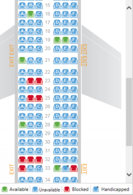

# Flight Seat Assignment Kata

You work as a software engineer for a large airline. They would like to create a process that takes unassigned passengers for each flight and assigns them to empty seats based on their preferences. See below for an example flight.

## Initial Assumptions

* You will never have more passengers than there are seats available
* You may assume that this airline is only ever going to have one format of plane (the one shown above)
